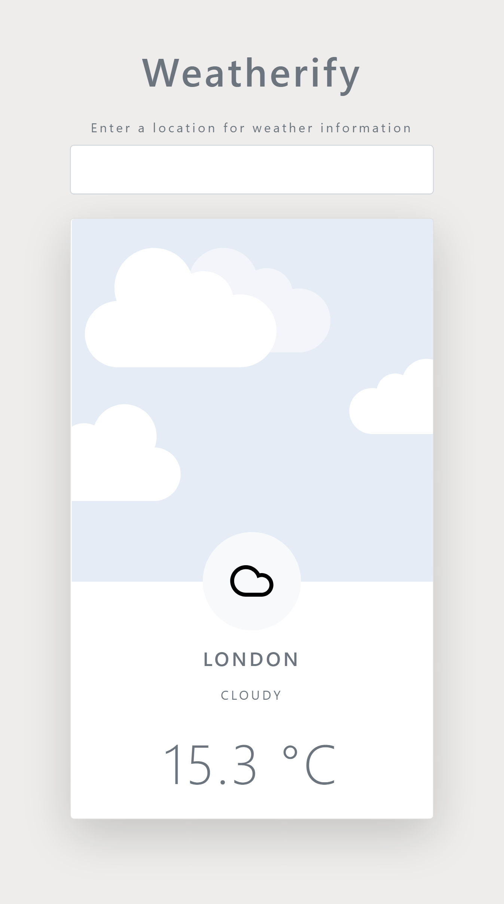

# weatherify
An Weather app using  AccuWeather API

### * Enter Any city name to get the current weather condition.

## Technologies used :  
  1. Javascript 
  2. Bootstrap 
  3. css 
  4. HTML 

## Screenshots:
  

(Note: AccuWeather API provides 50 requests per day for free use. If you want to test this Add Your own API)
